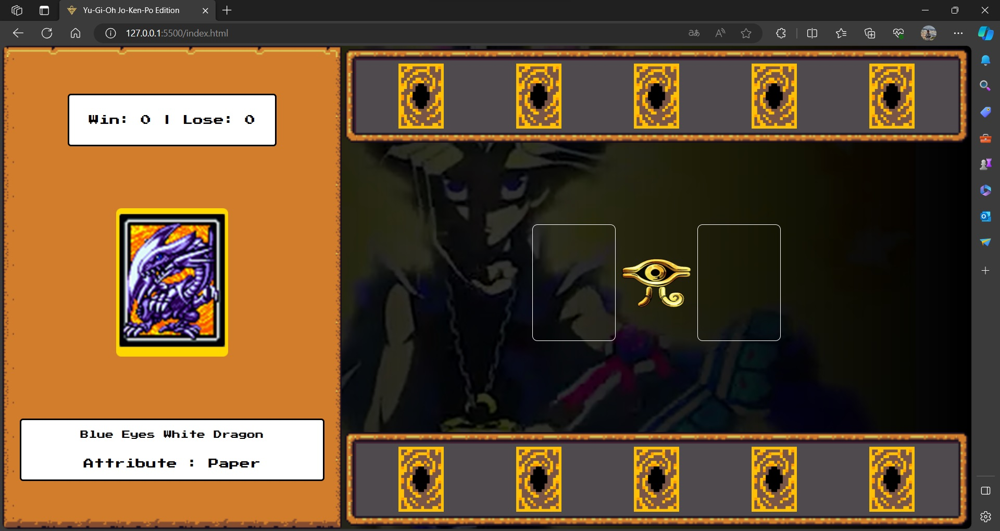

# DIO - Desafio de Projeto: Criando um Jogo de Cartas do Yu-Gi-Oh! com JavaScript e CSS

Neste projeto foi implementado um jogo de cartas estilo jo-ken-po com tema do Yu-Gi-Oh utilizando HTML, CSS e JavaScript para o Bootcamp Potência Tech iFood - Desenvolvimento de Jogos da Dio.

